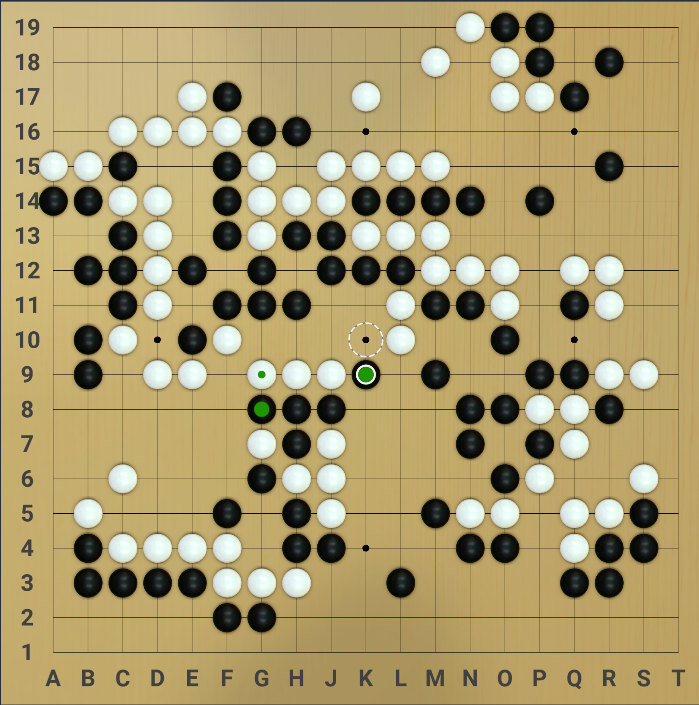
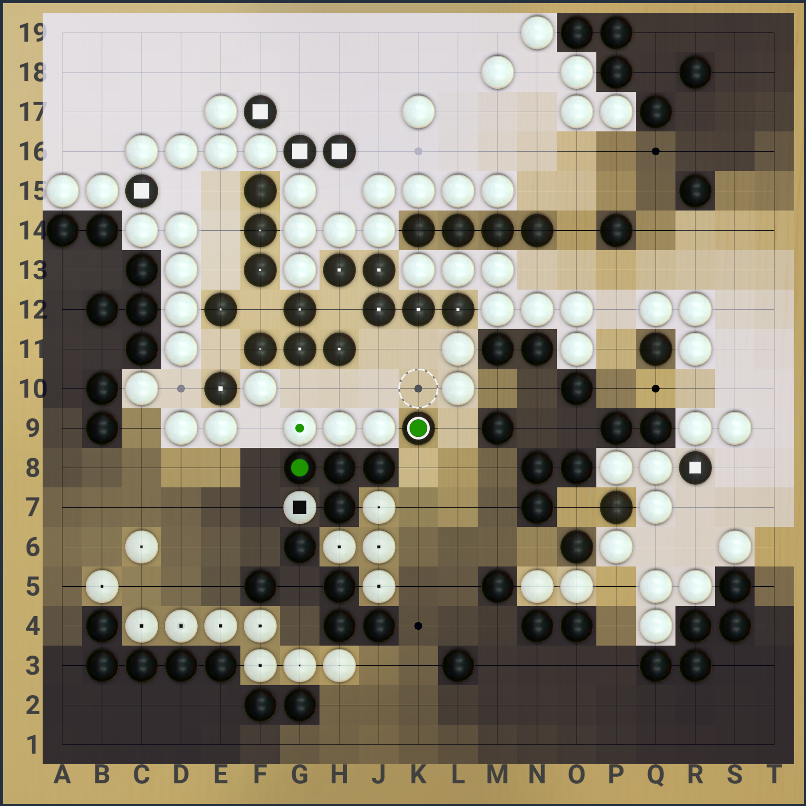

# Katrain-Theme-SoumyaK4
[Katrain](http://github.com/sanderland/katrain/releases) Theme: [BadukTV](https://github.com/upsided/Upsided-Sabaki-Themes#baduktv)+[JeffSounds](https://github.com/sanderland/katrain/blob/master/THEMES.md#jeff-sounds)

# Install
* To install a theme, simply unzip the [SoumyaK4-Katrain-Theme-BadukTV+JeffSounds.zip](https://github.com/SoumyaK4/Katrain-Theme-SoumyaK4/releases/download/v1/SoumyaK4-Katrain-Theme-BadukTV+JeffSounds.zip) to your .katrain folder. 
  * On Windows you can find it in ```C:\Users\you\\.katrain``` and on linux in ```~/.katrain.```
  * When in doubt, the general settings dialog will also show the location.
* To uninstall a theme, remove all theme relevant files from that folder.
  * If in doubt check [assets](https://github.com/SoumyaK4/Katrain-Theme-SoumyaK4/tree/main/assets) for the list of files.

# Notes
I was using Katrain on my friend's beefy PC, and wanted it to look like my preferred theme, added JeffSounds while trying to read the theme creation guide

# Preview
|  | |
| --- | ---|
| Territory blocks, no stones marked | Shaded territory, weak stones marked |
